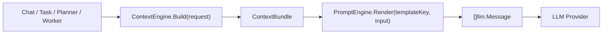

# 002 PromptEngine 与 ContextEngine 架构设计

## 1. 文档目标

本文定义 Wukong 中 `PromptEngine` 与 `ContextEngine` 的架构边界、组合方式与分阶段落地计划，用于统一项目中的提示词管理、上下文装配与消息生成链路。

设计目标：

- 统一管理 prompt 模板，消除散落在 `chat / task / planner / worker / react / tool` 中的硬编码提示词
- 统一管理上下文来源、裁剪、排序、降级与调试
- 保证 `PromptEngine` 与 `ContextEngine` 可以独立使用，也可以组合使用
- 为后续多轮对话、任务执行、记忆、RAG、技能插件扩展提供稳定基础

非目标：

- 本文不设计具体 LLM Provider 适配层
- 本文不引入数据库化 prompt 配置平台
- 本文第一版不处理精确 token 计费与复杂 DSL 模板系统

---

## 2. 当前项目现状

当前项目中 prompt 与 context 逻辑分散在多个模块内：

- `internal/service/chat_service.go`
  - Chat system prompt
  - 历史消息与会话记忆拼装
- `pkg/manager/llm_planner.go`
  - 任务规划 prompt
- `pkg/worker/exec_subtask.go`
  - 子任务 action prompt builder
- `pkg/worker/react.go`
  - ReAct prompt
- `pkg/tool/toolkit.go`
  - `llm_chat` 等工具级 prompt

存在的问题：

- prompt 命名与管理不统一
- 上下文来源和拼装逻辑耦合在业务代码中
- Chat、Task、Planner 的上下文能力难以复用
- 调试时难以知道最终喂给 LLM 的上下文来自哪里
- 后续做记忆、RAG、上下文预算时缺少统一入口

---

## 3. 总体设计原则

### 3.1 分层原则

将“说什么”和“拿什么来说”拆开：

- `PromptEngine`
  - 负责模板管理、变量渲染、消息输出
- `ContextEngine`
  - 负责上下文收集、规整、排序、裁剪、组合

### 3.2 组合原则

两个模块既可独立使用，也可串联：

- 只有 PromptEngine：适合固定消息模板
- 只有 ContextEngine：适合调试上下文装配
- PromptEngine + ContextEngine：适合生产链路

### 3.3 场景化原则

按 scene 组织能力，而不是按调用方散落组织：

- `chat`
- `task`
- `planner`
- `worker`
- `react`
- `tool_call`

### 3.4 渐进式原则

第一版先做“能统一管理、能替换现有硬编码、能落地”，不追求一次把所有高级能力都做完。

---

## 4. PromptEngine 架构

### 4.1 职责

`PromptEngine` 负责：

- 注册 prompt 模板
- 通过 key 查询模板
- 管理模板版本与描述信息
- 渲染模板变量
- 输出标准化 `[]llm.Message`
- 支持 system / user / assistant 多消息模板
- 为后续覆盖、扩展、版本切换预留接口

`PromptEngine` 不负责：

- 查询数据库
- 读取历史消息
- 召回记忆
- token 预算裁剪
- 直接调用 LLM

### 4.2 核心抽象

```go
type Engine struct {
    mu        sync.RWMutex
    templates map[string]*Template
}

type Template struct {
    Key         string
    Description string
    Version     string
    Messages    []MessageTemplate
}

type MessageTemplate struct {
    Role    string
    Content string
}

type RenderInput struct {
    Variables map[string]any
    Context   *ContextBundle
}
```

### 4.3 能力边界

第一版只支持：

- `{{var}}` 变量替换
- 输出 `[]llm.Message`
- 缺失变量报错或可配置忽略

第一版不支持：

- 模板条件分支 DSL
- 循环语法
- 数据库存储模板
- 实时在线编辑

### 4.4 模板命名规范

建议模板 key 统一命名：

- `chat.session.default`
- `chat.memory.summary`
- `planner.task.default`
- `worker.action.default`
- `worker.action.web_search`
- `worker.action.report_gen`
- `worker.react.default`
- `tool.llm_chat.default`

命名原则：

- 第一段为场景
- 第二段为子域
- 第三段为变体或默认值

---

## 5. ContextEngine 架构

### 5.1 职责

`ContextEngine` 负责：

- 定义上下文来源
- 从多个来源拉取上下文
- 规整为统一上下文块
- 执行去重、排序、窗口截断、预算裁剪、降级
- 输出标准化 `ContextBundle`

`ContextEngine` 不负责：

- 定义 prompt 文案
- 决定 system prompt 长什么样
- 直接调用 LLM

### 5.2 核心抽象

```go
type Engine struct {
    registry *SourceRegistry
    scenes   map[string]SceneConfig
}

type BuildRequest struct {
    Scene     string
    UserID    string
    SessionID string
    TaskID    string
    SkillName string
    Query     string
    Variables map[string]any
}

type ContextBundle struct {
    Scene  string
    Blocks []ContextBlock
    Named  map[string]string
    Text   string
    Meta   map[string]any
}

type ContextBlock struct {
    Name      string
    Type      string
    Source    string
    Content   string
    Priority  int
    Tokens    int
    Timestamp int64
}

type Source interface {
    Name() string
    Load(ctx context.Context, req BuildRequest) ([]ContextBlock, error)
}
```

### 5.3 ContextBlock 设计意义

所有上下文在进入 prompt 前都统一为 `ContextBlock`，例如：

- 历史消息
- 会话摘要
- 用户偏好
- 当前任务参数
- 子任务执行记录
- 工具调用输出
- 技能说明
- 静态系统规则

统一后带来的好处：

- 可以按块排序与裁剪
- 可以按块记录来源，便于调试
- 可以跨场景复用上下文来源
- PromptEngine 不需要了解每个来源细节

### 5.4 Source 设计

建议按来源拆 Source，而不是按业务函数拆：

- `ChatHistorySource`
- `ChatMemorySource`
- `TaskStateSource`
- `TaskTraceSource`
- `SkillSpecSource`
- `ToolResultSource`
- `StaticRuleSource`
- `UserProfileSource`
- `KnowledgeRetrieveSource`

第一版优先实现：

- `ChatHistorySource`
- `ChatMemorySource`
- `TaskStateSource`
- `SkillSpecSource`
- `StaticRuleSource`

### 5.5 Policy 设计

ContextEngine 通过 policy 组合装配行为：

```go
type Policy interface {
    Name() string
    Apply(ctx context.Context, blocks []ContextBlock, req BuildRequest) ([]ContextBlock, error)
}
```

第一版建议支持：

- `DedupePolicy`
- `PrioritySortPolicy`
- `RecentWindowPolicy`
- `TokenBudgetPolicy`

### 5.6 内部处理流程

ContextEngine 的标准 pipeline：

```text
select sources
-> load blocks
-> normalize
-> filter empty
-> dedupe
-> sort by priority/time
-> truncate by policy
-> build bundle
```

对应步骤：

1. 根据 scene 选择 sources
2. 拉取原始上下文块
3. 清理空块和异常块
4. 去重
5. 排序
6. 截断
7. 生成 `ContextBundle`

---

## 6. PromptEngine 与 ContextEngine 的组合方式

### 6.1 数据流



### 6.2 模块边界

组合原则：

- ContextEngine 输出结构化上下文
- PromptEngine 消费结构化上下文
- 业务层决定 scene、templateKey 和 request 参数

### 6.3 PromptEngine 如何消费上下文

推荐通过 `RenderInput` 传入上下文：

```go
type RenderInput struct {
    Variables map[string]any
    Context   *ContextBundle
}
```

模板可以消费：

- `{{context_text}}`
- `{{context.recent_messages}}`
- `{{context.memory_summary}}`
- `{{query}}`
- `{{skill_name}}`

第一版建议 `ContextBundle` 同时产出：

- `Blocks`
- `Named`
- `Text`

这样可以兼顾简单实现与后续扩展。

### 6.4 独立与组合使用

#### 独立使用 PromptEngine

适合：

- 固定 system prompt
- 工具调用 prompt
- 无复杂上下文依赖的任务

#### 独立使用 ContextEngine

适合：

- 调试上下文构成
- 输出上下文快照
- 为后续多种 prompt 做复用

#### 组合使用

适合：

- Chat 多轮对话
- Planner 任务拆解
- Worker / ReAct 子任务执行

---

## 7. 核心接口定义草案

### 7.1 PromptEngine 接口草案

```go
package prompt

type Engine struct {
    // ...
}

func New() *Engine

func (e *Engine) Register(t *Template) error

func (e *Engine) MustRegister(t *Template)

func (e *Engine) Get(key string) (*Template, bool)

func (e *Engine) Render(key string, input RenderInput) ([]llm.Message, error)

func (e *Engine) RenderTemplate(t *Template, input RenderInput) ([]llm.Message, error)
```

### 7.2 ContextEngine 接口草案

```go
package context

type Engine struct {
    // ...
}

func New(registry *SourceRegistry) *Engine

func (e *Engine) RegisterScene(name string, cfg SceneConfig) error

func (e *Engine) Build(ctx context.Context, req BuildRequest) (*ContextBundle, error)
```

### 7.3 Source 接口草案

```go
type Source interface {
    Name() string
    Load(ctx context.Context, req BuildRequest) ([]ContextBlock, error)
}
```

### 7.4 Policy 接口草案

```go
type Policy interface {
    Name() string
    Apply(ctx context.Context, blocks []ContextBlock, req BuildRequest) ([]ContextBlock, error)
}
```

### 7.5 SceneConfig 接口草案

```go
type SceneConfig struct {
    Sources  []string
    Policies []string
    Options  map[string]any
}
```

### 7.6 组合 Facade 草案

后续如需进一步收敛业务调用入口，可增加一层组合引擎：

```go
type ComposeEngine struct {
    prompt  *prompt.Engine
    context *context.Engine
}

type ComposeRequest struct {
    Scene       string
    TemplateKey string
    Build       context.BuildRequest
    Variables   map[string]any
}

func (e *ComposeEngine) BuildMessages(ctx context.Context, req ComposeRequest) ([]llm.Message, error)
```

说明：

- 该层不是第一版必需
- 第一版可由业务层显式串联 `ContextEngine.Build + PromptEngine.Render`

---

## 8. 分场景接入设计

### 8.1 Chat 场景

目标：

- 将 `chat_message` 历史和 `chat_memory` 记忆统一交由 ContextEngine 装配
- 将 chat system prompt 交由 PromptEngine 管理

建议 sources：

- `ChatMemorySource`
- `ChatHistorySource`
- `StaticRuleSource`

建议 template：

- `chat.session.default`

输出特点：

- 优先记忆摘要
- 最近 N 轮对话
- 当前 user query

### 8.2 Task / Worker 场景

目标：

- 统一子任务执行 prompt
- 把任务参数、技能说明、执行状态作为上下文块组合

建议 sources：

- `TaskStateSource`
- `SkillSpecSource`
- `StaticRuleSource`

建议 template：

- `worker.action.default`
- `worker.action.web_search`
- `worker.action.report_gen`

### 8.3 Planner 场景

目标：

- 将规划器 prompt 从 `llm_planner.go` 中抽出
- 使任务规划链路也能消费标准上下文

建议 sources：

- `TaskStateSource`
- `SkillSpecSource`
- `StaticRuleSource`

建议 template：

- `planner.task.default`

---

## 9. 分阶段实施计划

### 阶段一：PromptEngine 骨架

目标：

- 先统一 prompt 注册与渲染

任务：

1. 新建 `pkg/prompt/promptengine.go`
2. 定义 `Engine / Template / MessageTemplate / RenderInput`
3. 实现注册、获取、渲染
4. 增加单元测试

### 阶段二：PromptEngine 首批接入

目标：

- 替换硬编码 prompt 的低风险模块

任务：

1. 接入 `pkg/worker/exec_subtask.go`
2. 接入 `pkg/worker/react.go`
3. 接入 `pkg/manager/llm_planner.go`

### 阶段三：ContextEngine 骨架

目标：

- 建立统一上下文装配入口

任务：

1. 新建 `pkg/context/contextengine.go`
2. 定义 `BuildRequest / ContextBlock / ContextBundle / Source / Policy`
3. 实现基础 pipeline
4. 增加测试

### 阶段四：Chat 场景接入

目标：

- 先让多轮对话链路跑在新架构上

任务：

1. 实现 `ChatHistorySource`
2. 实现 `ChatMemorySource`
3. 定义 `chat` scene
4. 将 `chat_service.go` 改为通过 `ContextEngine + PromptEngine` 构建消息

### 阶段五：Task / Planner 场景接入

目标：

- 让任务执行与规划能力统一进入同一套架构

任务：

1. 实现 `TaskStateSource`
2. 实现 `SkillSpecSource`
3. 接入 `worker` 场景
4. 接入 `planner` 场景

### 阶段六：增强能力

目标：

- 增加可观测性与上下文智能裁剪能力

任务：

1. 增加上下文调试输出
2. 增加 token budget 裁剪
3. 增加 context snapshot 日志
4. 为 RAG / user profile / tool memory 预留扩展点

---

## 10. 可观测性与调试建议

建议在两类引擎中补充调试能力。

### PromptEngine 调试建议

- 输出模板 key、版本
- 输出渲染后的 message 数量
- 输出缺失变量列表

### ContextEngine 调试建议

- 输出 scene
- 输出命中的 sources
- 输出每个 block 的来源、优先级、长度
- 输出裁剪前后 block 数量

建议调试输出结构化记录，便于日志分析。

---

## 11. 风险与控制

### 风险 1：过度设计

控制方式：

- 第一版只做模板管理和上下文装配，不做平台化配置中心

### 风险 2：接入范围过大

控制方式：

- 优先接入 `worker -> react -> planner -> chat`
- Chat 放在 PromptEngine 和 ContextEngine 骨架稳定后再切换

### 风险 3：上下文链路变复杂后难排查

控制方式：

- 强制保留 `ContextBlock.Source / Name / Priority`
- 保留调试快照和结构化日志

---

## 12. 结论

本设计的核心结论如下：

- `PromptEngine` 决定表达结构
- `ContextEngine` 决定信息供给
- 两者通过 `ContextBundle` 和 `RenderInput` 连接
- 两者可以独立存在，也可以组合成为统一消息构建链路
- 第一阶段先统一 prompt，第二阶段再统一 context，最终逐步接入 chat、task、planner

最终目标不是再增加一个工具模块，而是为 Wukong 建立“统一 prompt + 统一 context + 统一消息生成”的基础设施。

