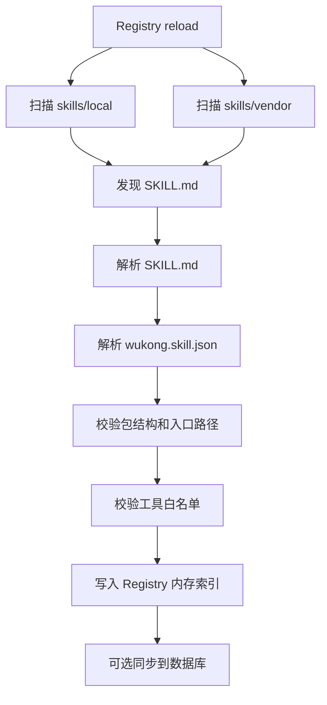
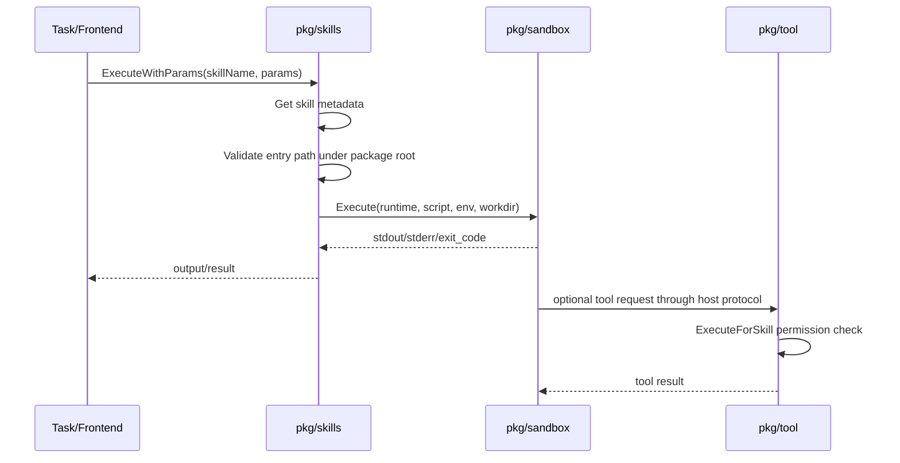

# 第三方 Skills 运行能力开发设计

## 1. 背景

`docs/design/004_third_part_skills_design_draft.md` 的目标是让 Wukong 可以运行第三方 Agent Skills，例如 `skills-pptx` 这类独立 Skill 包。第一版不做在线市场、不做自动从 npm/GitHub 拉取、不做复杂依赖解析，而是支持用户把已经下载好的 Skill 包放入固定目录后，由系统发现、校验、授权并通过 sandbox 执行。

当前项目已经具备三块基础能力：

- `pkg/skills`：解析 `SKILL.md`、维护 skill 注册表、执行 skill 脚本。
- `pkg/tool`：注册内置工具，并通过 `ExecuteForSkill` 做 skill 到 tool 的权限检查。
- `pkg/sandbox`：统一进程级沙箱，限制 runtime、命令白名单、工作目录、环境变量、超时和输出大小。

这一轮第三方 Skills 的重点不是重写这三块，而是把“下载后的第三方包”纳入一条可管理、可校验、可执行的链路。

## 2. 目标

第一版目标：

- 支持手动安装第三方 Skill 包到 `skills/vendor/<skill-name>/`。
- 支持本地自定义 Skill 包放到 `skills/local/<skill-name>/`。
- `pkg/skills` 可以扫描 `local` 和 `vendor` 两类来源。
- 解析并校验 `SKILL.md`、脚本入口、引用目录、工具白名单。
- 执行第三方 Skill 时统一走 `pkg/sandbox`。
- 第三方 Skill 调用系统能力时必须通过 `pkg/tool.ExecuteForSkill` 做授权。
- 对安装来源、版本、包路径、启用状态留出元数据。

暂不做：

- 自动联网下载 GitHub/npm 包。
- 自动更新和版本市场。
- 包签名校验。
- 复杂依赖安装。
- 容器级隔离。

## 3. 推荐目录结构

```text
wukong/
  skills/
    local/
      my-report-skill/
        SKILL.md
        scripts/
        references/
        assets/
    vendor/
      skills-pptx/
        SKILL.md
        scripts/
        references/
        assets/
        wukong.skill.json
```

目录说明：

- `skills/local`：项目内自定义或用户自己写的 skill。
- `skills/vendor`：第三方下载后手动放入的 skill。
- `SKILL.md`：Agent Skills 规范入口文件，继续作为主描述文件。
- `wukong.skill.json`：Wukong 可选扩展元数据，用于记录来源、版本、运行时、权限声明。
- `scripts`：脚本入口所在目录。
- `references`：只读参考材料。
- `assets`：模板、图片、PPTX 模板等资源。

## 4. 程序模块设计

### 4.1 `pkg/skills` 职责

`pkg/skills` 是第三方 Skill 的发现、解析、校验和执行编排层。

建议拆分或新增文件：

```text
pkg/skills/
  types.go              # Skill / Param / MemoryConfig / SourceType / PackageMeta
  parser.go             # 解析 SKILL.md
  manifest.go           # 解析 wukong.skill.json
  registry.go           # 注册表、查询、列表
  discovery.go          # 扫描 local/vendor 多来源目录
  validator.go          # 包结构、路径、入口、权限校验
  executor.go           # 组装 sandbox.Request 并执行
  installer.go          # 手动安装目录校验、启用/禁用、后续扩展下载入口
  watcher.go            # 目录变更 reload
```

新增核心类型草案：

```go
type SourceType string

const (
    SourceBuiltin SourceType = "builtin"
    SourceLocal   SourceType = "local"
    SourceVendor  SourceType = "vendor"
)

type PackageMeta struct {
    SourceType  SourceType `json:"source_type"`
    PackageName string     `json:"package_name"`
    Version     string     `json:"version"`
    Homepage    string     `json:"homepage,omitempty"`
    Runtime     string     `json:"runtime,omitempty"`
    Entry       string     `json:"entry,omitempty"`
    RootDir     string     `json:"root_dir"`
}
```

`Skill` 建议增加字段：

```go
Package PackageMeta `json:"package"`
```

第一版也可以先不改数据库结构，只在内存中保留 `SourcePath` 和 `Package`，后续再落库。

### 4.2 `pkg/tool` 职责

`pkg/tool` 不负责发现第三方 Skill，只负责执行能力和权限边界。

现有 `ExecuteForSkill(ctx, skillName, toolName, params)` 是正确方向，但需要强化：

- skill 不存在时不应绕过策略直接执行工具。
- 第三方 Skill 调 tool 必须存在于 `Skill.Tools` 白名单。
- 可增加 tool 参数 schema 校验，防止第三方 Skill 传入危险参数。
- 文件类工具应限制在允许目录，例如 `storage/output_data`、skill 自己的工作目录。
- 网络类工具后续可按 skill 权限声明启用。

建议新增：

```go
type SkillToolPolicy struct {
    SkillName string
    AllowedTools []string
    AllowNetwork bool
    FileRoots []string
}
```

第一版仍然可以复用 `Skill.Tools`，但要把“不存在 skill 时绕过策略”的行为改成拒绝。

### 4.3 `pkg/sandbox` 职责

`pkg/sandbox` 是第三方 Skill 脚本执行的唯一入口。

已有能力已经覆盖第一版需求：

- runtime 白名单。
- 命令白名单。
- 工作目录限制。
- 环境变量过滤。
- 超时。
- 输出截断。

第三方 Skill 执行时建议这样构造：

```go
sandbox.Request{
    Runtime:    skill.Package.Runtime,
    ScriptPath: absEntryPath,
    WorkDir:    skillRoot,
    Env: map[string]string{
        "SKILL_NAME": skill.SkillName,
        "SKILL_PARAMS": jsonParams,
        "WUKONG_SKILL_ROOT": skillRoot,
        "WUKONG_OUTPUT_DIR": outputDir,
    },
    Timeout: execTimeout,
}
```

安全要求：

- `WorkDir` 必须是当前 Skill 包根目录。
- `ScriptPath` 必须位于当前 Skill 包根目录内。
- `references`、`assets` 默认只读使用。
- 输出目录统一使用系统配置，例如 `storage/output_data`。
- 第三方 Skill 不能直接读写项目任意目录。

## 5. 第三方 Skill 包格式

### 5.1 必需文件

```text
skills/vendor/skills-pptx/
  SKILL.md
```

`SKILL.md` 至少需要包含：

```markdown
# Skill: skills-pptx

## Description
Generate PowerPoint slides from structured content.

## Params
- topic: string(required)
- outline: string(optional)

## Tools
- file_write
- file_read

## Execute
- scripts/run.py
```

### 5.2 可选扩展元数据

```json
{
  "package_name": "skills-pptx",
  "version": "0.1.0",
  "runtime": "python",
  "entry": "scripts/run.py",
  "homepage": "https://example.com/skills-pptx",
  "permissions": {
    "tools": ["file_write", "file_read"],
    "network": false
  }
}
```

优先级建议：

1. 如果 `wukong.skill.json` 存在，以其中的 `runtime` 和 `entry` 为准。
2. 如果不存在，则使用 `SKILL.md` 的 `## Execute`。
3. runtime 可从扩展名推断：`.py`、`.js`、`.ts`、`.sh`、`.ps1`、`.go`、`.java`。

## 6. 加载流程



当前 `loadFromDisk()` 只扫描 `rootDir` 下的一层目录。需要改为扫描多个 source root：

local和vendor可在configs/dev.yaml中配置，默认在rootDir下一层目录。

- `skills/local/*/SKILL.md`
- `skills/vendor/*/SKILL.md`
- 兼容旧目录：`skills/*/SKILL.md`

建议 `Registry` 增加：

```go
type SkillRoot struct {
    Type SourceType
    Dir  string
}

type Registry struct {
    roots []SkillRoot
}
```

配置方式：

```go
skills.New(
    skills.WithRootDir("skills"),
    skills.WithSkillRoots(
        skills.SkillRoot{Type: skills.SourceLocal, Dir: "skills/local"},
        skills.SkillRoot{Type: skills.SourceVendor, Dir: "skills/vendor"},
    ),
)
```

## 7. 执行流程



第一版可以只支持脚本通过环境变量拿参数、通过 stdout 返回结果。后续如果要让第三方 Skill 在运行过程中调用 `pkg/tool`，建议增加 host tool bridge。

## 8. Tool Bridge 设计

第三方 Skill 如果要调用系统工具，有两种方案。

### 方案 A：脚本只输出 tool request

脚本 stdout 输出 JSON：

```json
{
  "tool": "file_write",
  "params": {
    "title": "ppt report",
    "content": "..."
  }
}
```

`pkg/skills` 捕获后调用：

```go
toolManager.ExecuteForSkill(ctx, skillName, toolName, params)
```

优点是简单，适合 MVP。缺点是只能做单次工具调用，不适合复杂交互。

### 方案 B：stdin/stdout JSON-RPC

`pkg/skills` 启动脚本后，通过 stdin/stdout 与脚本持续通信：

```json
{"id":"1","method":"tool.call","params":{"tool":"file_write","params":{}}}
```

优点是能力完整，适合后续让 `skills-pptx` 在生成 PPTX 时多次读模板、写文件、调 LLM。缺点是实现复杂。

建议第一阶段采用方案 A，第二阶段再做 JSON-RPC。

## 9. `skills-pptx` 示例运行链路

手动安装：

```text
wukong/skills/vendor/skills-pptx/
  SKILL.md
  wukong.skill.json
  scripts/run.py
  references/ppt_style.md
  assets/default_template.pptx
```

执行：

1. 用户在任务中心选择 `skills-pptx`。
2. Task service 将 `skill_name=skills-pptx` 传给任务执行链。
3. `pkg/skills.Registry` 找到 vendor skill。
4. `pkg/skills.Executor` 构造 `sandbox.Request`。
5. `pkg/sandbox` 在 `skills/vendor/skills-pptx` 下运行 `scripts/run.py`。
6. 脚本生成结果文件请求。
7. `pkg/tool.ExecuteForSkill` 检查 `skills-pptx` 是否允许 `file_write`。
8. `file_write` 将 PPTX 或报告写入 `storage/output_data/<date>/...`。
9. 任务详情页展示执行结果和文件路径。

## 10. 安全边界

第一版必须做到：

- 不允许第三方 Skill 直接执行任意命令。
- 不允许脚本入口路径跳出 skill 包目录。
- 不允许 skill 未声明工具就调用工具。
- 不允许未知 skill 绕过 tool 权限。
- 不允许默认传递全部环境变量。
- 不允许脚本默认访问项目根目录作为工作目录。
- 输出需要限制大小，避免刷爆日志或内存。
- 超时必须强制终止。

建议修正现有行为：

- `pkg/tool.Manager.ExecuteForSkill` 当前在 skill 不存在时会 bypass policy 并直接执行工具。第三方 Skills 场景下应改为拒绝，或者增加明确的 `AllowUnknownSkillDirectToolCall` 开关，默认关闭。

## 11. 分阶段任务规划

### 阶段一：第三方目录发现

目标：让系统能发现 `skills/local` 和 `skills/vendor`。

任务：

1. 在 `pkg/skills` 增加 `SourceType`、`SkillRoot`、`PackageMeta`。
2. 增加 `WithSkillRoots(...)` 配置。
3. 改造 `loadFromDisk()` 为多 root 扫描。
4. 保留兼容旧的 `skills/<name>/SKILL.md`。
5. 增加单元测试：local/vendor/legacy 三种目录都能加载。

### 阶段二：包校验和 manifest

目标：第三方包必须结构合法才能进入 Registry。

任务：

1. 新增 `manifest.go` 解析 `wukong.skill.json`。
2. 新增 `validator.go` 校验 `SKILL.md`、入口文件、路径越界、tools 白名单。
3. runtime 优先读 manifest，不存在时按脚本扩展名推断。
4. 增加单元测试：入口不存在、入口越界、未知 runtime、非法 tools。

### 阶段三：sandbox 执行强化

目标：第三方 Skill 执行完全走 sandbox，且工作目录限制在包内。

任务：

1. `ExecuteWithParams` 使用 skill package root 作为 `WorkDir`。
2. `sandbox.Policy.AllowedWorkRoots` 限制为当前 skill root 和必要输出目录。
3. 增加 `WUKONG_SKILL_ROOT`、`WUKONG_OUTPUT_DIR` 等白名单环境变量。
4. 增加单元测试：第三方 `.py/.js/.ps1` 能执行，越界脚本被拒绝。

### 阶段四：tool 权限收紧

目标：第三方 Skill 只能调用声明过的工具。

任务：

1. 修改 `ExecuteForSkill`：未知 skill 默认拒绝。
2. 对 `Tool.ParameterSchema()` 做基础参数校验。
3. 增加 `ExecuteForSkill` 单测：允许工具通过，未授权工具拒绝，未知 skill 拒绝。
4. 文件工具确认仍限制在配置目录。

### 阶段五：Task 流程接入

目标：任务中心选择第三方 Skill 后可以运行。

任务：

1. Task submit 参数保留/确认 `skill_name`。
2. Worker 执行时根据 `skill_name` 调用 `pkg/skills.ExecuteWithParams` 或保留现有 planner/worker skill 选择策略。
3. 任务事件记录 skill 来源、入口、sandbox exit code。
4. 前端任务详情展示第三方 Skill 输出和文件路径。
5. 增加集成测试：提交 `skills-pptx` 示例 skill，任务能完成并生成文件。

### 阶段六：Tool Bridge MVP

目标：第三方脚本可以请求系统工具。

任务：

1. 定义 stdout JSON tool request 格式。
2. `pkg/skills` 解析脚本输出中的 tool request。
3. 调用 `tool.Manager.ExecuteForSkill`。
4. 返回 tool result 到 task result。
5. 增加测试：第三方 skill 请求 `file_write` 成功，请求未授权 tool 失败。

## 12. 测试计划

单元测试：

- `pkg/skills`：多目录扫描、manifest 解析、包校验、runtime 推断。
- `pkg/sandbox`：工作目录限制、脚本入口限制、env 白名单、timeout。
- `pkg/tool`：第三方 skill 权限检查、未知 skill 拒绝、参数 schema 校验。

回归测试：

- 内置 skills 仍可加载。
- 旧目录 `skills/<name>` 仍可兼容。
- 当前 task 提交和 skill 选择不回退。
- `file_write` 输出路径仍按现有规则生成。

集成测试：

- 构造一个 `skills/vendor/echo-skill`，执行后返回 stdout。
- 构造一个 `skills/vendor/file-skill`，请求 `file_write` 并生成文件。
- 构造一个 `skills/vendor/skills-pptx` mock 包，生成 `.pptx` 或 markdown 文件路径，任务详情可查看。

## 13. 推荐优先级

最小闭环建议先做：

1. 多目录扫描：`skills/local`、`skills/vendor`。
2. 入口路径校验：不能跳出包根目录。
3. sandbox 执行：WorkDir 固定为 skill 包根。
4. tool 权限收紧：未知 skill 不允许直接执行工具。
5. 一个 mock `skills-pptx` 集成测试。

这条闭环完成后，Wukong 就具备了“手动下载第三方 Skill 包后可运行”的基础能力。
